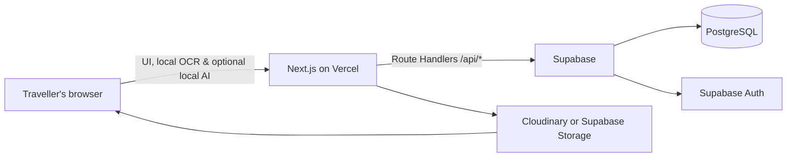

# TripMate

<p align="center">
  <strong>A shared operating system for group trips.</strong><br />
  Plan together · spend fairly · keep every memory
</p>

<p align="center">
  <a href="#quick-start">Quick start</a> ·
  <a href="#what-it-solves">Use case</a> ·
  <a href="#architecture">Architecture</a> ·
  <a href="#configuration">Configuration</a> ·
  <a href="#deployment">Deployment</a>
</p>

<p align="center">
  
  
  
  
</p>

---

## What it solves

Group travel becomes fragmented fast: one person books a stay, someone else pays for fuel, photos live across multiple phones, and settling the final balance becomes awkward. TripMate gives a trip crew one shared, mobile-first place to coordinate the journey.

| Before TripMate | With TripMate |
| --- | --- |
| Expenses spread across messages and notes | Exact shared ledger with balances and settlements |
| “Who paid for this?” | Payer, split, receipt, category, and participant history |
| Photos disappear into individual galleries | Shared originals, albums, tags, favourites, and downloads |
| Itinerary exists in several chats | Collaborative stops, packing ownership, maps, calendar export, and reminders |
| Contact details are hard to find under pressure | Crew directory, safe contacts, drivers, stays, and SOS shortcuts |

## Product tour

### 💸 Money that stays fair

- Equal, exact, percentage, shares, and itemized expense splits.
- Integer-paise calculations to avoid floating-point rounding mistakes.
- Per-person balance visibility and simplified settlement suggestions.
- UPI-friendly settlement prompts and receipt attachments.
- Natural-language and voice-assisted expense entry with review before saving.

### 🧭 A plan the entire crew can use

- Shared itinerary with times, notes, locations, map links, and Google Calendar actions.
- Calendar `.ics` export with configurable alarm reminders.
- Arrival, adventure, and departure itinerary templates.
- Assigned/shared packing items, quick packing kits, and progress tracking.
- Searchable trip stops, venue notes, and booking references.

### 📸 A proper trip memory vault

- Original-quality photo and video upload through Cloudinary or Supabase Storage.
- Default **Everyone** album, themed albums, favourites, member tags, and direct downloads.
- Member-aware media filtering: see all crew media or a person’s uploads and tags.
- Full-screen viewer for photos and videos.

### 🤖 Private, optional on-device assistance

- Optional Qwen 0.5B and 1.5B quantized models run in the browser via Transformers.js.
- The downloaded model can refine typed or voice expense details and receipt OCR text.
- OCR uses Tesseract in the browser; financial totals remain deterministic and users review every suggestion.
- No AI API key is required for these local features.

### 👥 Travel coordination and safety

- Trip dashboard with personal spend, trip total, activity, balances, and fast actions.
- Crew profile, payment preferences, appearance, and local AI settings in one account area.
- Directory for family contacts, drivers, stays, activities, and emergency numbers.
- Responsive bottom navigation, fast route prefetching, light mode by default, and PWA install support.

## Architecture

TripMate does have a backend. It uses a modern serverless architecture rather than a permanently running Express server.



| Layer | Responsibility |
| --- | --- |
| **Next.js 16 App Router** | UI, layouts, metadata, route transitions, and server-side API route handlers |
| **Vercel Functions** | Executes `/api/*` handlers for trips, members, expenses, media, planning, settlements, exports, and account actions |
| **Supabase** | PostgreSQL, authentication, SSR sessions, migrations, and optional file storage |
| **Cloudinary** | Optimised delivery and original storage for uploaded images and videos when configured |
| **Browser** | Responsive UI, PWA install, speech recognition, receipt OCR, and optional local AI inference |

## Technology

| Area | Tools |
| --- | --- |
| Framework | Next.js 16, React 19, TypeScript |
| UI | Tailwind CSS v4, CSS variables, Framer Motion, Radix primitives, Lucide icons |
| Data | Supabase PostgreSQL and `@supabase/supabase-js` |
| Auth | Supabase Auth with SSR-aware cookies |
| Media | Cloudinary or Supabase Storage |
| Charts & feedback | Recharts, Sonner |
| Local intelligence | Transformers.js, Qwen ONNX Q4 models, Tesseract.js |
| File utilities | JSZip, browser calendar (`.ics`) export |
| Deployment | Vercel (recommended), Docker / Docker Compose also included |

## Quick start

### Prerequisites

- Node.js 20.9+ (Node 20 LTS recommended)
- npm 10+
- A Supabase project
- Cloudinary credentials **only** when Cloudinary is the selected media provider

### 1. Clone and install

```bash
git clone https://github.com/VED045/TripMate.git
cd TripMate
npm install
```

### 2. Add local configuration

```bash
cp .env.example .env.local
```

Complete the values in `.env.local`. Never commit this file.

### 3. Apply database migrations

In the Supabase SQL Editor, run the migration files in order:

```text
supabase/migrations/001_initial_schema.sql
supabase/migrations/002_itemized_splits.sql
supabase/migrations/003_payment_states.sql
supabase/migrations/004_member_soft_deletion.sql
supabase/migrations/005_whatsapp_group.sql
supabase/migrations/006_auth_profiles.sql
supabase/migrations/007_profiles_repair.sql
supabase/migrations/008_trip_planning.sql
```

> Vercel deploys application code; it does not automatically run Supabase SQL migrations.

### 4. Start developing

```bash
npm run dev
```

Visit [http://localhost:3000](http://localhost:3000). For a production check, run:

```bash
npm run build
```

## Configuration

Use `.env.example` as the source of truth. The common settings are:

| Variable | Required | Purpose |
| --- | --- | --- |
| `NEXT_PUBLIC_SUPABASE_URL` | Yes | Supabase project URL |
| `NEXT_PUBLIC_SUPABASE_ANON_KEY` | Yes | Public Supabase browser key |
| `SUPABASE_SERVICE_ROLE_KEY` | Yes, server only | Privileged database/storage work in trusted route handlers |
| `NEXT_PUBLIC_STORAGE_PROVIDER` | Yes | `cloudinary` or `supabase` |
| `CLOUDINARY_CLOUD_NAME` | Cloudinary only | Cloudinary cloud identifier |
| `CLOUDINARY_API_KEY` | Cloudinary only | Cloudinary API key |
| `CLOUDINARY_API_SECRET` | Cloudinary only | Cloudinary API secret — never expose in the browser |
| `MAX_IMAGE_SIZE_MB` | No | Upload limit; defaults to 50 MB |
| `MAX_VIDEO_SIZE_MB` | No | Upload limit; defaults to 500 MB |

## API surface

All application endpoints are Next.js route handlers under `app/api`.

| Area | Routes |
| --- | --- |
| Account | `/api/account/profile`, `/api/account/password-reset` |
| Trips & members | `/api/trips`, `/api/trips/[id]`, `/api/trips/[id]/claim`, `/api/user/trips`, `/api/members` |
| Expenses & settlements | `/api/expenses`, `/api/settlements`, `/api/export` |
| Planning | `/api/planning` |
| Media & albums | `/api/media`, `/api/media/[id]`, `/api/media/upload`, `/api/media/download`, `/api/albums` |
| Activity | `/api/timeline` |

## Security checklist

- [x] Keep `.env.local` out of Git.
- [x] Use the Supabase anon key only in browser-safe code.
- [x] Keep the Supabase service-role key and Cloudinary secret server-only.
- [x] Validate file type, size, and IDs in media routes.
- [ ] Verify authenticated trip membership in every privileged API route before using service-role database access.
- [ ] Enable and test production Supabase Row Level Security policies as the app evolves.

The last two items are deliberate production hardening priorities. A service-role client bypasses RLS, so route handlers must independently authorize the signed-in user and their trip membership.

## Deployment

### Vercel

1. Import the GitHub repository into Vercel.
2. Add the environment variables from `.env.local` to **Production**, **Preview**, and **Development** as appropriate.
3. Apply the Supabase migrations separately.
4. Push to `main`; Vercel builds and deploys automatically.

```bash
git push origin main
```

### Docker

The repository includes a `Dockerfile` and `docker-compose.yml` for self-hosting:

```bash
docker compose up --build
```

Supply the same environment variables to the container runtime.

## Project map

```text
app/                  Pages, metadata, and server-side route handlers
components/           Feature and shared React components
lib/                  Supabase, storage, settlement, AI, and utility modules
supabase/migrations/  Ordered database migrations
types/                Shared TypeScript domain types
public/               PWA manifest and static assets
```

## Contributing workflow

```bash
# Type-check without emitting files
npx tsc --noEmit --incremental false

# Run the production build
npm run build
```

Keep changes focused, avoid committing secrets, and add a migration whenever a database schema change is required.

---

<p align="center">
  Built for the part of travel that happens between the destination and the memories. 🧭
</p>
